# XX-Net 详细图文教程
****
可能是上次的教程写的比较粗糙吧，很多人多没配置成功，现在加上一篇图文的XX-Net，希望对大家有帮助
****

## 详细步骤
### 下载最新版的XX-Net
- &ensp;&ensp;&ensp;&ensp;首先我们到官网下载XX-Net的最新版的，这个翻墙软件是开源的，免费使用的，在githup上有人维护的，我们尽量下最新版的，老师的版本好像太低了，之前我配置的时候也一直不成功，群里上次的版本没试过，但大家下最新版的准没错，反正是免费的，嘿嘿。

- &ensp;&ensp;&ensp;&ensp;我现在的电脑关闭了XX-Net，目前是没法翻墙，我们直接在百度或必应上搜索XX-Net，搜索结果如下图：

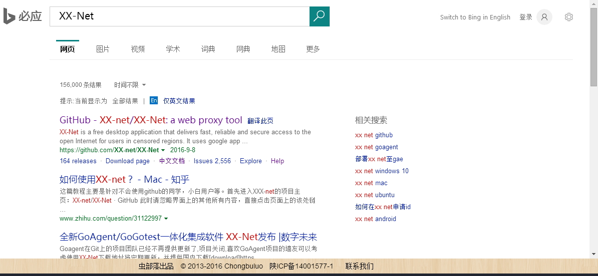

- &ensp;&ensp;&ensp;&ensp;我们选择githup的那个，我的是第一个，你们是有可能顺序不一样，打开以后是下面的那样：

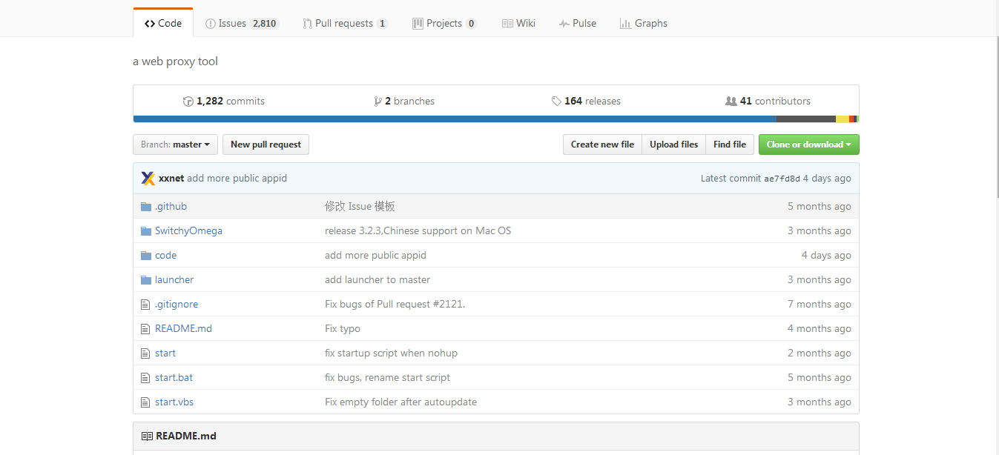

- &ensp;&ensp;&ensp;&ensp;接下来我们点击右上角的Clone or download，再选择Download ZIP下载整个工程的压缩包：

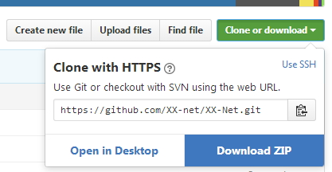

- &ensp;&ensp;&ensp;&ensp;下载后解压都任意位置，然后打开文件下的start.bat,下面会弹出来DOS控制台，会自动打开默认浏览器进入XX-Net配置界面，如下图：

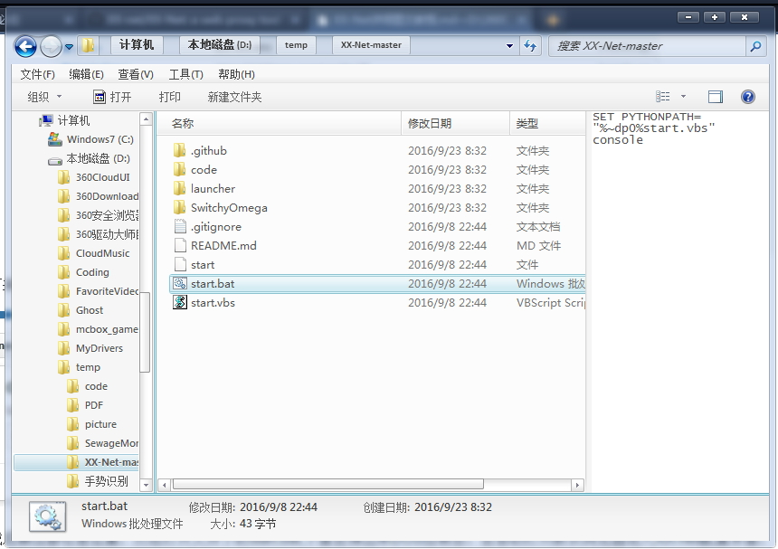

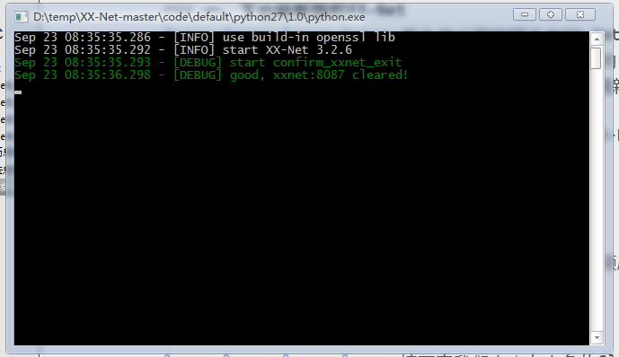

- &ensp;&ensp;&ensp;&ensp;我现在配置的时候第一次打开失败了

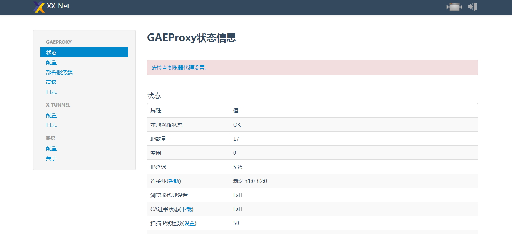

- &ensp;&ensp;&ensp;&ensp;这种情况很正常，很多不小心的因素都会导致这个结果，现在这个问题关闭浏览器，然后重新启动XX-Net就行了；以后如果遇到类似的情况可能有两种（我在使用过程中遇到的）：一是VPN代理问题，可能是现在你在使用VPN软件之类的，这样你也打开配置界面失败，可能是两者冲突的问题，这个把VPN翻墙代理软件关了，再重启XX-Net即可；二是浏览器插件问题，之前我在360浏览器安装了个视频广告拦截插件后就不能使用XX-Net，我把那个浏览器插件卸载以后就可以使用了，大家在使用的失败的时候可以看看是不是浏览器插件问题。

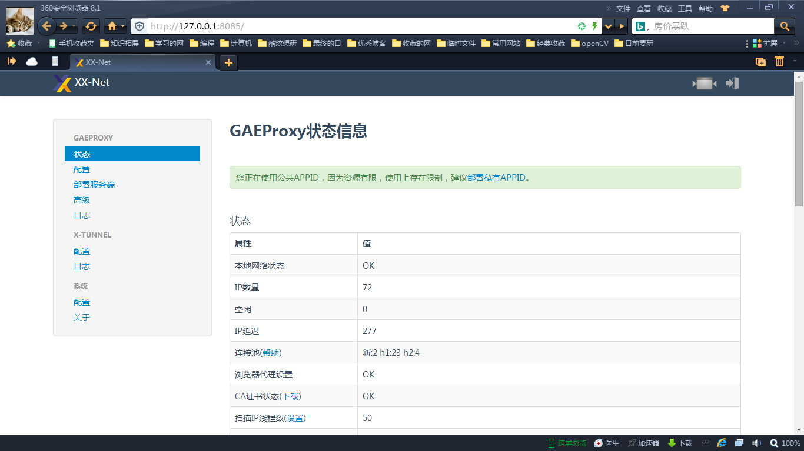

### 申请谷歌邮箱账号(有账号的可以跳过这一步)
- &ensp;&ensp;&ensp;&ensp;在上面完成以后就可以简单的翻墙了，如果不看视频的话完全可以使用了，我感觉网速也不是太慢，还可以用。但如果你想要看翻墙视频的话就得有一个谷歌邮箱账号去申请appid（既谷歌应用工程），如果大家有自己的谷歌账号，就可以直接跳过这一步。

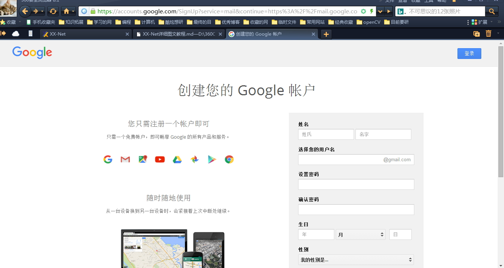

- &ensp;&ensp;&ensp;&ensp;申请时根据想应的要求填写即可，需要注意的是在填写手机号码的时候，要在前面加上+86,这样前面后显示中国的相应图标，如果不加上这个，可能手机会收不到相应的验证信息；还有就是申请成功以后第一时间登陆谷歌邮箱更改一下设置，看看在电话号码那个选项是不是中国，不是的话就改回来（以前自己的邮箱里不知怎么不是中国，自己申请账号也填写了+86，但一直收不到邮箱验证码，然后那个账号就废了，哎）

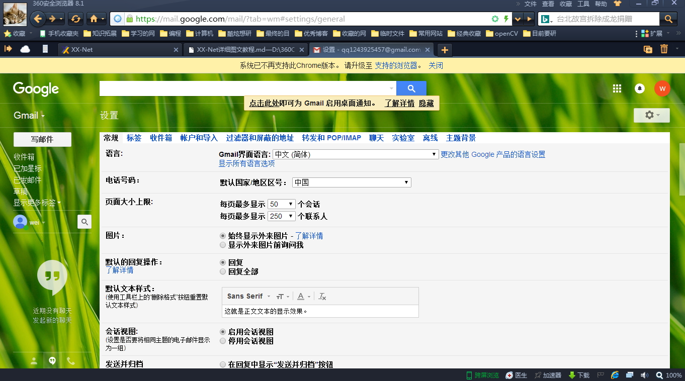

### 申请appid
- &ensp;&ensp;&ensp;&ensp;要进入那个appid界面用搜索好像是不行，总是弹出什么注册免费试用的那个，最近要国庆了，钱有点紧张，我们这种贫苦百姓看到这个界面就有比较烦了！说好的免费呢！而且看起来好麻烦！要简单纸上好吧！嘿嘿，让我们用其他方式进行appid设置界面：

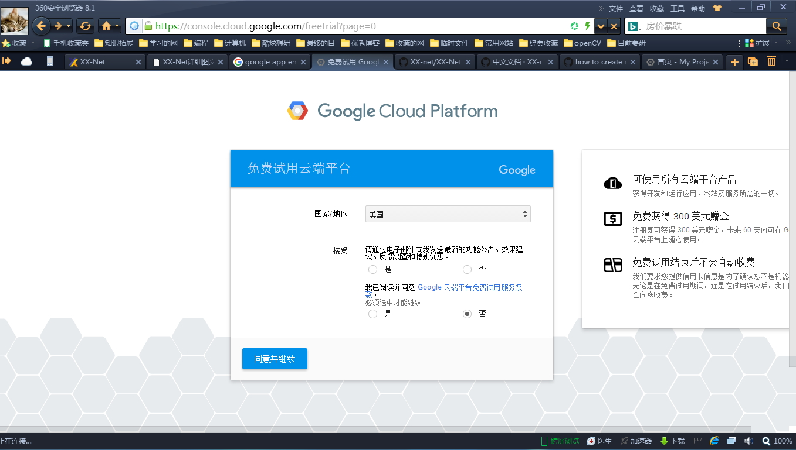

- &ensp;&ensp;&ensp;&ensp;我们先进入我们下载XX-Net的那个githup界面，然后点击下面的中文文档，再点击创建个人appid（图文详细版），打开后滚动到申请appid，点击第一步的链接后就进入我们想要的界面了

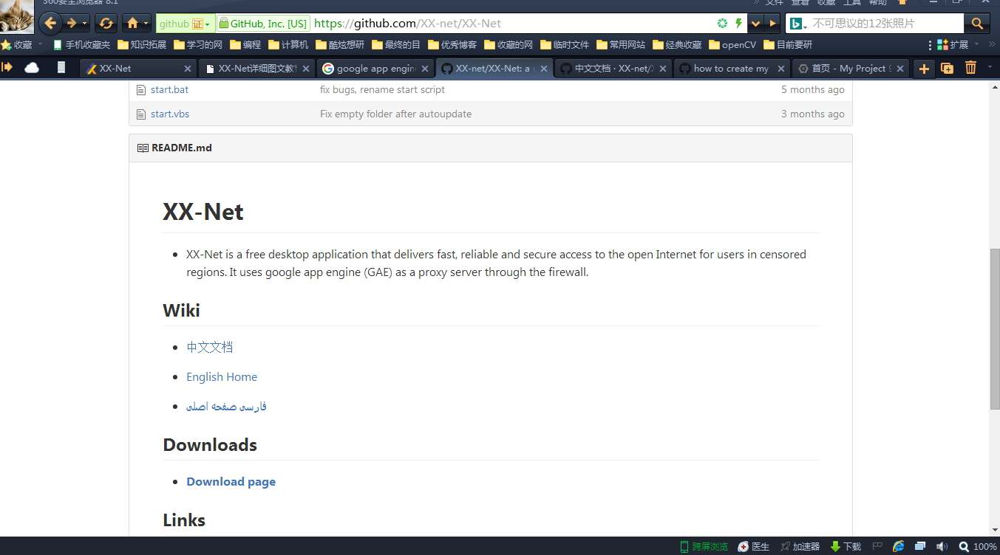
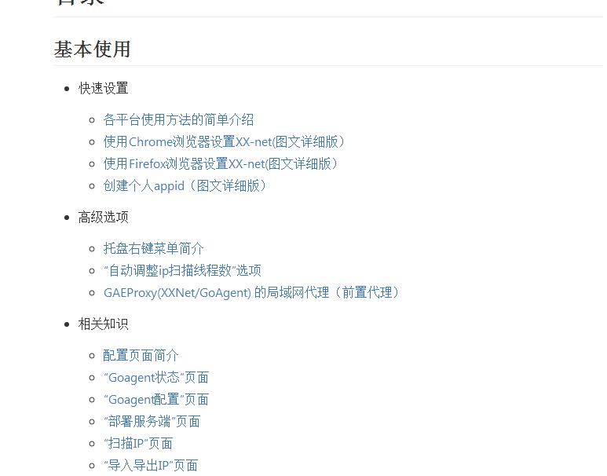

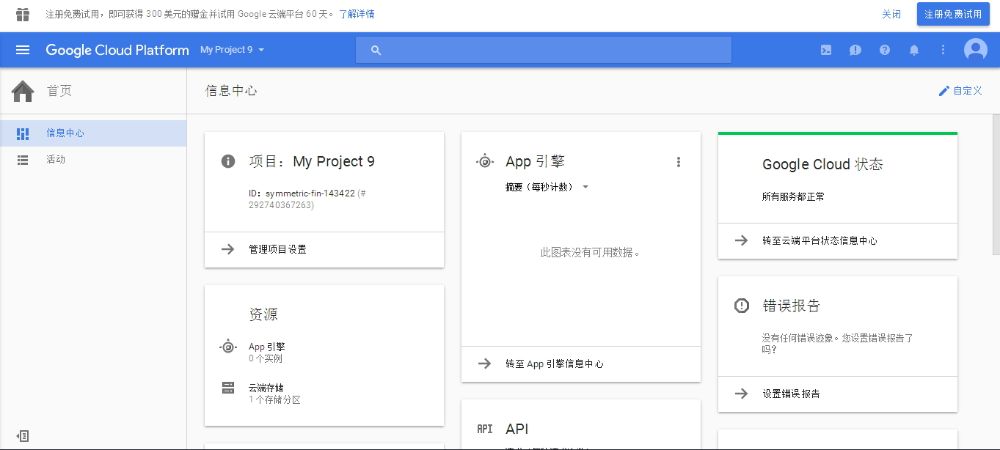

- &ensp;&ensp;&ensp;&ensp;接下来申请appid即可，点击下图中的创建项目即可（我的已经创建到十二个的上限了，不能再创建了），我推荐是直接默认即可，一直创建十二个，这样appid就申请成功了

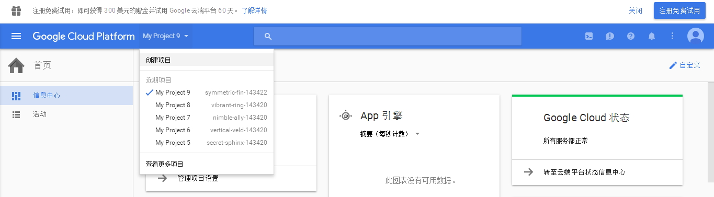

### 配置私有ID
- &ensp;&ensp;&ensp;&ensp;接下来是最后一步了，也是最重要的一步了，嘿嘿。我们进入XX-Net的设置界面，点击到部署服务端哪里

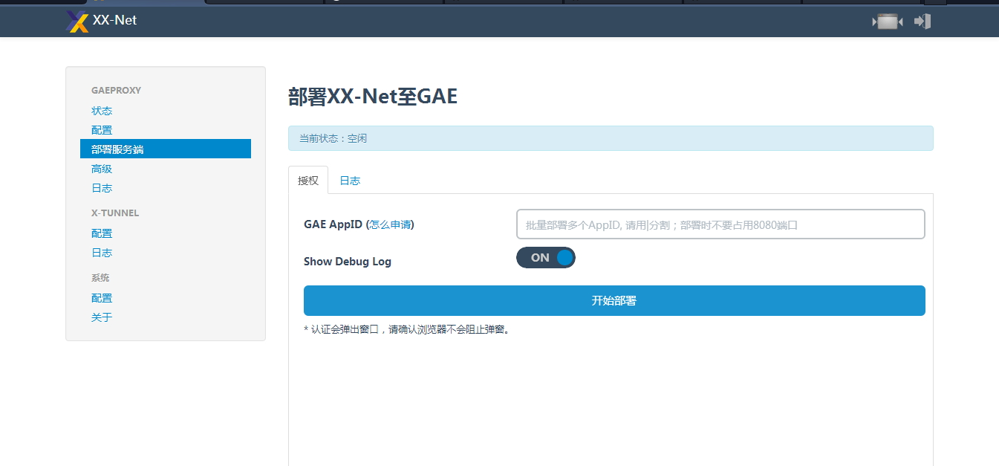

- &ensp;&ensp;&ensp;&ensp;然后点击工程菜单哪里，选择查看更多项目，再随便选择一个项目打开，接下来你会看到左上角有你的appid的ID账号（还有其他方式查看这个ID，但这就不详细说了，早上写教程比较困，嘿嘿），把它复制下来

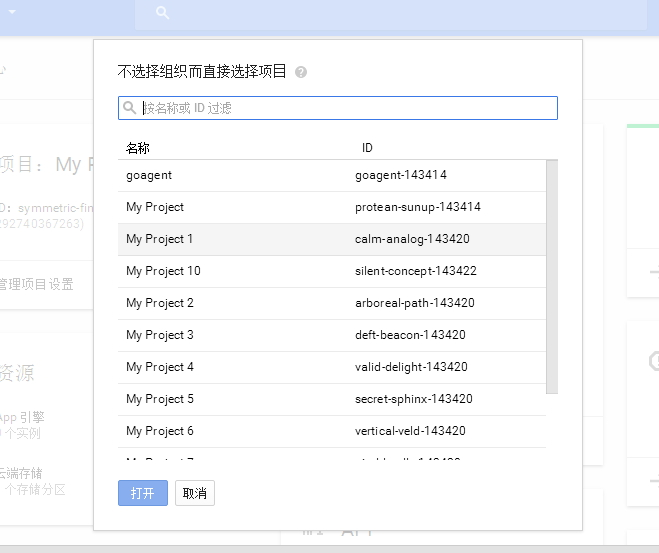
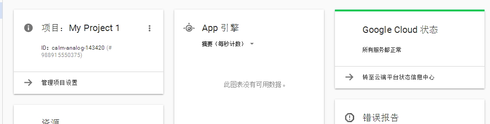

- &ensp;&ensp;&ensp;&ensp;先让我们开启弱安全权限，后面要用到。点击[设置部署权限](https://github.com/XX-net/XX-Net/wiki/how-to-create-my-appids)，我们选择弱安全应用，进入后选择开启即可（这个需要登录相应的谷歌账号）

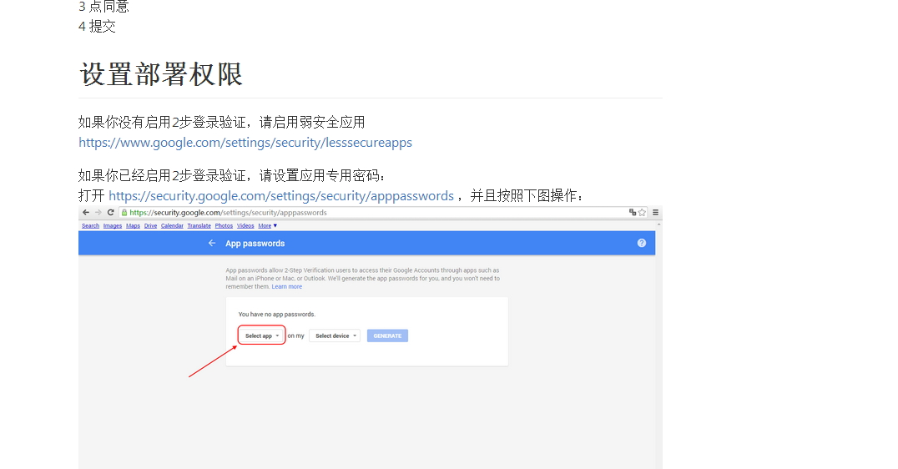
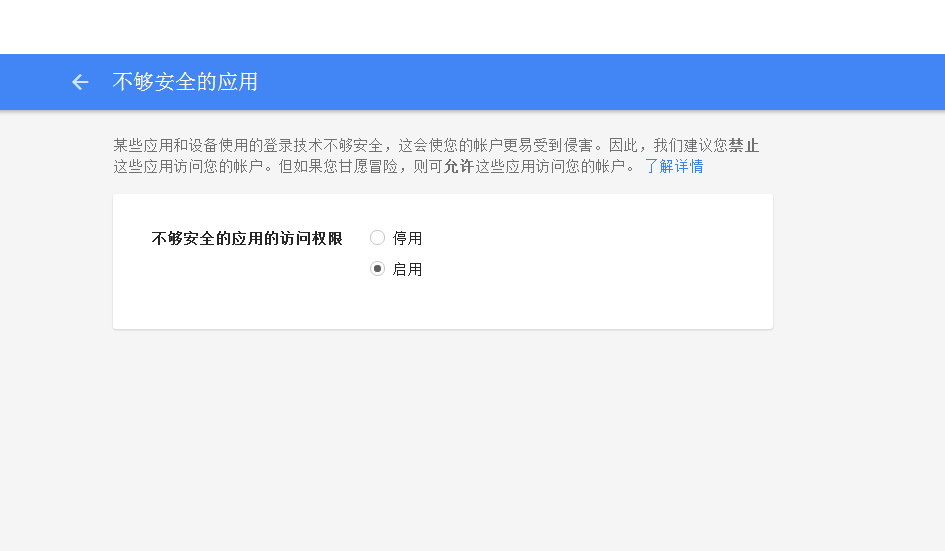

- &ensp;&ensp;&ensp;&ensp;我们把刚才复制下来的账号粘贴到XX-Net部署服务端的界面中，然后点击开始部署，一会它会弹出一个谷歌账号权限申请界面（这个要开启我们的账号什么弱安全应用，就是上面的一步），我们确认即可，然后出现一些英文，我们把那个页面关了，等几秒钟XX-Net就部署成功了（部署不成功的话，看看前面的步骤有没有落下的，不成功的情况我没遇到好，希望大家好运）

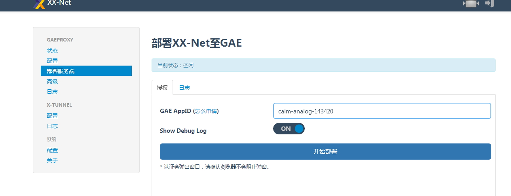
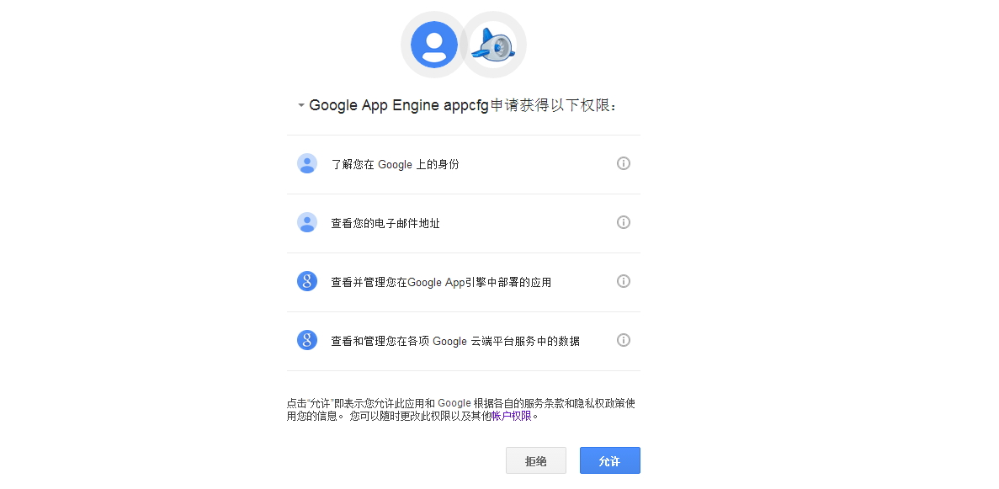
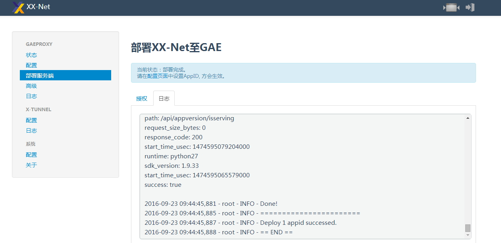

- &ensp;&ensp;&ensp;&ensp;成功以后进入XX-Net配置，把ID账号粘贴进去，点击保存，去状态看看如下图就恭喜成功了，进去看看视频先，说实话这个网速还是可以的，看视频我到现在没卡过，关键完全免费，这种不用白不用是不是。预祝各位成功，愉快玩耍

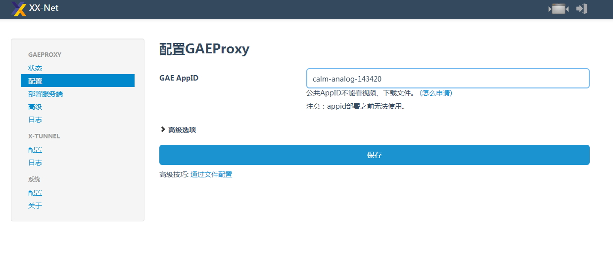
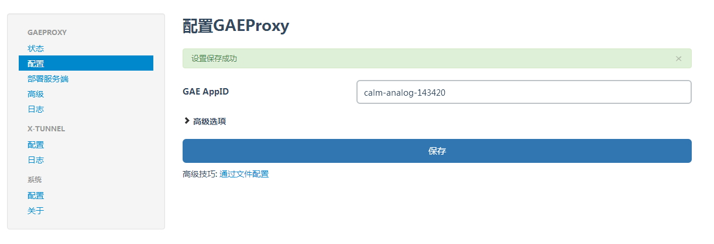
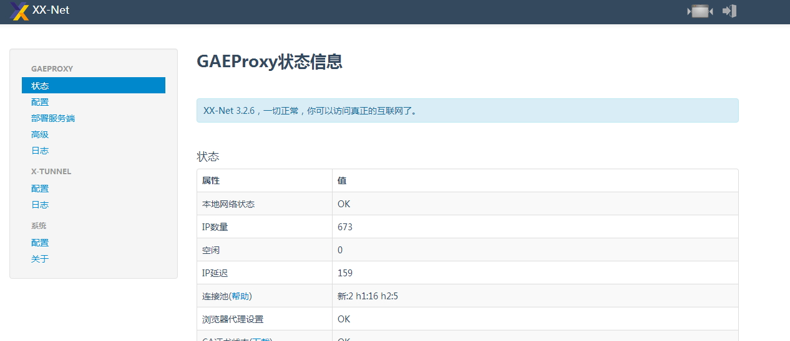
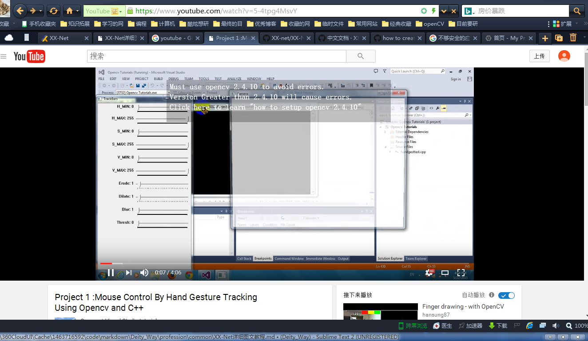

