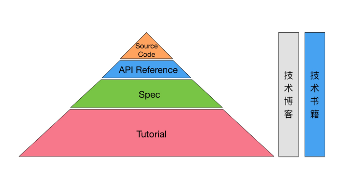

# 如何学习一门新技术--《技术的正宗与野路子》
***
*本文参考文章：《技术的正宗与野路子》，链接：[http://www.techug.com/post/learn-tech-method.html](http://www.techug.com/post/learn-tech-method.html)*

## 文中精华部分
### 资料分类
- Tutorial（入门教程）。由该项技术的官网提供。通常是英文的。这份资料是给初次接触该项技术的人看的，一般是一步一步地教你完成某些例子。当我们说某项技术对于新手不太友好的时候，一般也是因为这项技术的Tutorial部分做得不够好。
- Specification，简称Spec。这是集中体现该项技术的设计思想的东西，是高度抽象的描述。这个一般也是一份完备的、系统的描述，包 含该项技术涉及到的方方面面。这部分资料在不同的地方叫法不同，在相对简单的技术项目中，也可能没有；在另一些情况下，这部分资料混杂在其它文档资料之 中；它还可能以论文（paper）的形式出现。
- API Reference。大而全的API索引和文档，针对不同的语言接口可能提供多份。当我们使用这项技术进行编程的时候，API Reference自然是个离不开的、总是要不停去查询的一份资料。
- 别人写的技术博客。质量良莠不齐，到底有没有价值，我们要学会去分辨。
- 技术书籍。跟技术博客类似，质量有好有坏。稍后我们和技术博客放在一起来分析。
- Source Code。如果我们要学习的技术是开源的，那么很幸运，我们能得到源代码。这是一份终极资料。

### 如何学习
&ensp;&ensp;&ensp;&ensp;最开始，一般读完Tutorial之后，就基本能上手做一些开发工作了。然后一边开发，一边查阅API Reference。注意，从这时候起，你的老板就开始向你付工资了，因为你的工作已经能够产出成果了。

&ensp;&ensp;&ensp;&ensp;我见过的很多技术牛人，他们如果不是把一项技术至少理解到Spec那个层次，他们是不敢随便写代码的。相反另一些人则从网上随意拷贝代码，并在自己 不能完全理解的情况下用到项目中去。技术牛人们当然也参考网上的代码，但他们通常会确保它的每一部分都能安放在知识金字塔的某一部分，他们不容许那种不属 于任何体系的知识孤岛的出现。

&ensp;&ensp;&ensp;&ensp;我们现在可以这样总结，技术的“野路子”，其实是知识结构的不完整和不系统造成的一种状态。只有当你冲破知识金字塔层层的障碍，迈向更高层次的时候，老板才开始向你付高价。

&ensp;&ensp;&ensp;&ensp;下面是学习资料的金字塔模型：

- 通读Spec。读完就不再困惑。
- 重要部分的API Reference要通读。里面包含了很多跟实现有关的信息。
- 如果工作需要，还可能需要读到Source Code。特别是对于平常一直在使用的SDK，不一定从头到尾把源码读通，这样工作量太大且效率不高，但一定要把你的开发环境设置成一点击某个调用的方法就能跳转进源码实现。只有这样，你才能把平常开发的时间利用起来，随时随刻都点过去看源码。