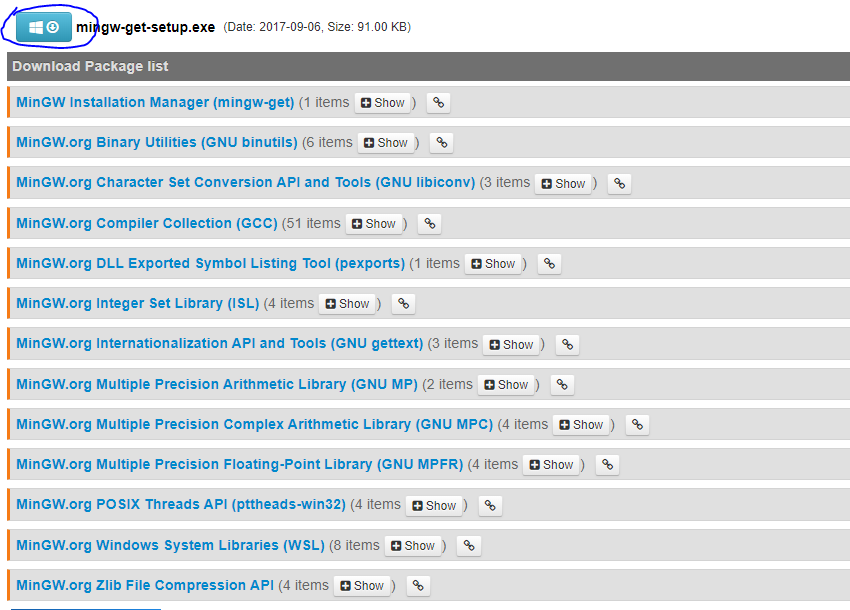
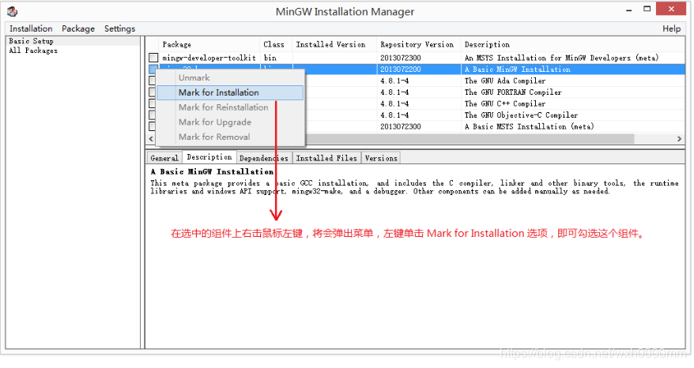
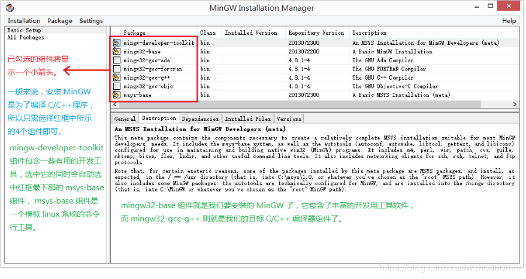
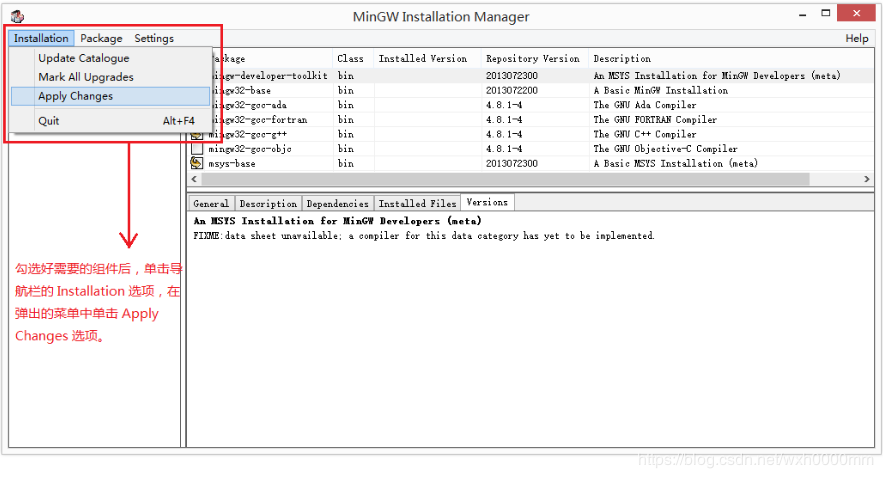
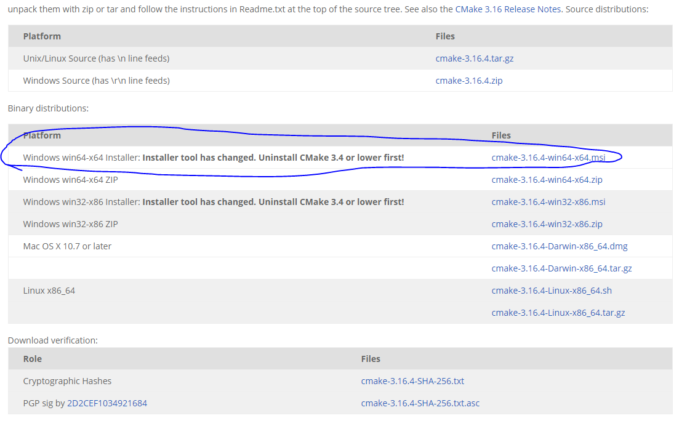

# Windows C/C++环境配置
***
## 综述
&ensp;&ensp;&ensp;&ensp;本篇文章进行C/C++环境配置,安装的内容如下:MinGW,Cmake,Clion(使用这个公司的产品习惯了,感觉比较顺手)

&ensp;&ensp;&ensp;&ensp;也可以直接安装visual studio,安装完成后就可以直接使用,下载链接:https://visualstudio.microsoft.com/zh-hans/vs/ ,使用社区版的即可

### MinGW安装
&ensp;&ensp;&ensp;&ensp;首先进行官网进行下载,链接:https://osdn.net/projects/mingw/releases/ , 进入页面后往下拉,点击下面图片中的蓝色标记的按钮后进行下载页面,下载后进行安装后运行

&ensp;&ensp;&ensp;&ensp;成功安装后需要选择下载的组件,如下图所示:组件上单击鼠标右键，再在弹出的右键菜单中单击 Mark for Installation 选项，即可将组件进行标记。在之后的操作完成后，管理器将会自动安装被标记了的组件

&ensp;&ensp;&ensp;&ensp;因为我们只是为了编译 C/C++ 程序，所以只需安装 mingw-developer-toolkit、mingw32-base、mingw32-gcc-g++、msys-base 这4个组件即可

&ensp;&ensp;&ensp;&ensp;在我们所需的4个组件都已标记完成后，单击菜单栏上的 Installation 选项，并在弹出的菜单中单击 Apply Changes 选项。后面窗口直接单击 Apply 按钮，之后安装管理器就会真正的开始下载安装 MinGW 了。

&ensp;&ensp;&ensp;&ensp;更加详细的安装教程请参考链接:https://blog.csdn.net/wxh0000mm/article/details/100666329

### cmake安装
&ensp;&ensp;&ensp;&ensp;进入下载链接:https://cmake.org/download/ ,点击下图所示的64位安装包进行下载

&ensp;&ensp;&ensp;&ensp;安装完成后运行安装即可,其中有一步是添加cmake到环境变量中,选择第二个或第三个选项即可

### Clion下载
&ensp;&ensp;&ensp;&ensp;下载链接:https://www.jetbrains.com/clion/ ,下载完成后进行安装即可

&ensp;&ensp;&ensp;&ensp;也可以使用官方的管理工具:https://www.jetbrains.com/toolbox-app/ ,下载后使用这个进行安装,这个类似软件管理器,新建cmake工程,它会自动检测mingw环境