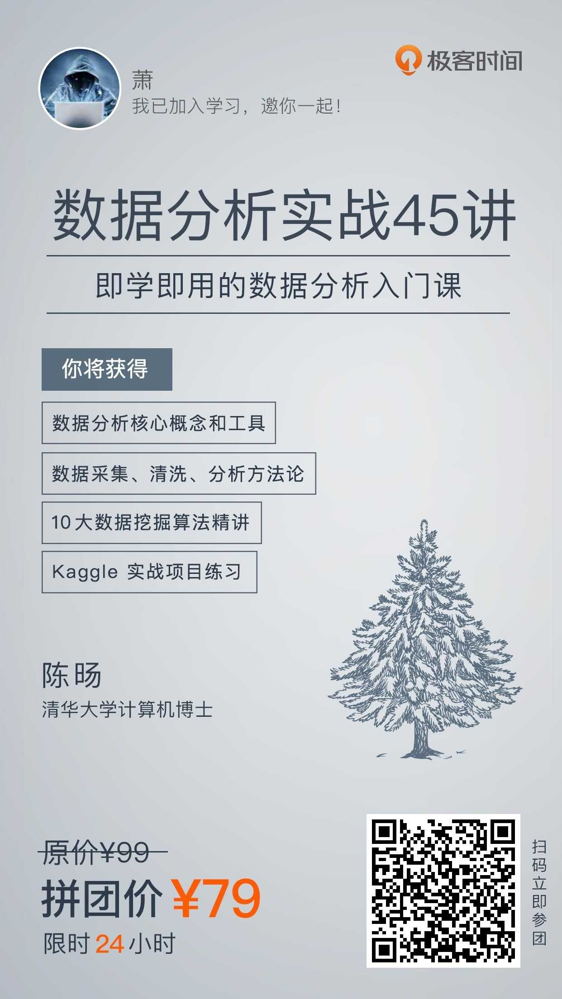

# 决策树之构造生成
***
## 参考说明
&ensp;&ensp;&ensp;&ensp;本文参考以下两个来源，在下面的文章中没有一个完整的生成示例，在本人学习过程中带来了很多的困惑，这篇文档展示一个完整的决策树的生成过程，希望对学习过程中的我们有所帮助：

- 极客时间：《数据分析实战45讲》：17、18、19讲
- 周志华：《机器学习》：第四章 决策树

## 示例数据表格
&ensp;&ensp;&ensp;&ensp;文章所使用的数据集如下，来源于《数据分析实战45讲》17讲中

|天气|温度|湿度|刮风|是否打篮球|
|----|:--:|:--:|:--:|--------|
|晴   |高  |中  |否  |否      |
|晴   |高  |中  |是  |否      |
|阴   |高  |高  |否  |是      |
|小雨 |高  |高  |否  |是      |
|小雨 |低  |高  |否  |否      |
|晴天 |中  |中  |是  |是      |
|阴天 |中  |高  |是  |否      |

## 相关概念阐述
### 决策树
&ensp;&ensp;&ensp;&ensp;以上面的表格数据为例，比如我们考虑要不要去打篮球，先看天气是不是阴天，是阴天的话，外面刮风没，没刮风我们就去，刮风就不去。决策树就是把上面我们判断背后的逻辑整理成一个结构图，也就是一个树状结构。

### ID3、C4.5、CART
&ensp;&ensp;&ensp;&ensp;在决策树构造中有三个著名算法：ID3、C4.5、CART，ID3算法计算的是信息增益，C4.5计算使用的是增益率、CART计算使用的是基尼系数，下面简单介绍下其算法，这里也不要求完全看懂，扫一眼有个印象就行，在后面的例子中有计算示例，回过头结合看应该就懂了。

#### 信息熵
&ensp;&ensp;&ensp;&ensp;在信息论中，随机离散事件的出现的概率存在不确定性，为了衡量这种信息的不确定性，信息学之父香农引入了信息熵的概念，并给出了计算信息熵的数学公式。

```
Entopy(t)=-Σp(i|t)log2p(i|t)
```

#### 信息增益
&ensp;&ensp;&ensp;&ensp;信息增益指的是划分可以带来纯度的提高，信息熵的下降。它的计算公式是父亲节点的信息熵减去所有子节点的信息熵。信息增益的公式可以表示为：

```
Gain(D,a)=Entropy(D)- Σ|Di|/|D|Entropy(Di)
```

#### 信息增益率
&ensp;&ensp;&ensp;&ensp;信息增益率 = 信息增益 / 属性熵。属性熵，就是每种属性的信息熵，比如天气的属性熵的计算如下,天气有晴阴雨,各占3/7,2/7,2/7：

```
H(天气)= -(3/7 * log2(3/7) + 2/7 * log2(2/7) + 2/7 * log2(2/7)) 
```

#### 基尼系数
&ensp;&ensp;&ensp;&ensp;基尼系数在经济学中用来衡量一个国家收入差距的常用指标.当基尼指数大于0.4的时候,说明财富差异悬殊.基尼系数在0.2-0.4之间说明分配合理,财富差距不大.扩展阅读下[基尼系数](https://zh.wikipedia.org/wiki/%E5%9F%BA%E5%B0%BC%E7%B3%BB%E6%95%B0)

&ensp;&ensp;&ensp;&ensp;基尼系数本身反应了样本的不确定度.当基尼系数越小的时候,说明样本之间的差异性小,不确定程度低.

&ensp;&ensp;&ensp;&ensp;CART算法在构造分类树的时候,会选择基尼系数最小的属性作为属性的划分.

&ensp;&ensp;&ensp;&ensp;基尼系数的计算公式如下:

```
Gini = 1 – Σ (Pi)2 for i=1 to number of classes
```

## 举例说明
&ensp;&ensp;&ensp;&ensp;下面是一个完整的决策树的构造生成过程，已完整开头所给的数据为例

### 根节点的选择
&ensp;&ensp;&ensp;&ensp;在上面的列表中有四个属性:天气,温度,湿度,刮风.需要先计算出这四个属性的信息增益、信息增益率、基尼系数

&ensp;&ensp;&ensp;&ensp;数据集中有7条数据，3个打篮球，4个不打篮球，不打篮球的概率为4/7,打篮球的概率为3/7,则根据信息熵的计算公式可以得到根节点的信息熵为：

```
Ent(D)=-(4/7 * log2(4/7) + 3/7 * log2(3/7))=0.985
```

#### 天气
&ensp;&ensp;&ensp;&ensp;其数据表格如下:

|天气状态|打篮球数量|不打篮球数量|总数|
|-------|:------:|:---------:|---|
|晴     |1        |2         |3  |
|阴     |1        |1         |2  |
|小雨   |1        |1         |2  |

##### 信息增益计算
&ensp;&ensp;&ensp;&ensp;如果将天气作为属性划分，分别会有三个叶节点：晴天、阴天、小雨，其中晴天2个不打篮球，1个打篮球；阴天1个打篮球，1个不打篮球；小雨1个打篮球，1个不打篮球，其对应相应的信息熵如下：

```
D(晴天)=-(1/3 * log2(1/3) + 2/3 * log2(2/3)) = 0.981
D(阴天)=-(1/2 * log2(1/2) + 1/2 * log2(1/2)) = 1.0
D(雨天)=-(1/2 * log2(1/2) + 1/2 * log2(1/2)) = 1.0
```

&ensp;&ensp;&ensp;&ensp;在数据集中晴天有3条数据，阴天有2条数据，雨天有2条数据，对应的概率为3/7、2/7、2/7，那么作为子节点的归一化信息熵为：

```
3/7 * 0.918 + 2/7 * 1.0 * 2/7 * 1.0 = 0.965
```

&ensp;&ensp;&ensp;&ensp;其信息增益为：

```
Gain(天气)=0.985 - 0.965 = 0.020
```

##### 信息增益率计算
&ensp;&ensp;&ensp;&ensp;天气有三个选择，晴天有3条数据，阴天有2条数据，雨天有2条数据，对应的概率为3/7、2/7、2/7，其对应的属性熵为：

```
H(天气)=-(3/7 * log2(3/7) + 2/7 * log2(2/7) + 2/7 * log2(2/7)) = 1.556
```

&ensp;&ensp;&ensp;&ensp;则其信息增益率为：

```
Gain_ratio(天气)=0.020/1.556=0.012
```

##### 基尼系数计算
- Gini(天气=晴)=1 - (1/3)^2 - (2/3)^2 = 1 - 1/9 - 4/9 = 4/9
- Gini(天气=阴)=1 - (1/2)^2 - (1/2)^2 = 1 - 1/4 - 1/4 = 0.5
- Gini(天气=小雨)=1 - (1/2)^2 - (1/2)^2 = 1 - 1/4 - 1/4 = 0.5
- Gini(天气)=(3/7) * 4/9 + (2/7) * 0.5 + (2/7) * 0.5 = 4/21 + 1/7 + 1/7 = 10/21

#### 温度
&ensp;&ensp;&ensp;&ensp;其数据表格如下:

|温度状态|打篮球数量|不打篮球数量|总数|
|-------|:------:|:---------:|---|
|高     |2        |2         |4  |
|中     |1        |1         |2  |
|低     |0        |1         |1  |

##### 信息增益计算
&ensp;&ensp;&ensp;&ensp;各情况的信息熵如下：

```
D(高)=-(2/4 * log2(2/4) + 2/4 * log2(2/4)) = 1.0
D(中)=-(1/2 * log2(1/2) + 1/2 * log2(1/2)) = 1.0
D(低)=-(0/1 * log2(0/1) + 1/1 * log2(1/1)) = 0.0
```

&ensp;&ensp;&ensp;&ensp;作为子节点的归一化信息熵为：

```
4/7 * 1.0 + 2/7 * 1.0 * 1/7 * 0.0 = 0.857
```

&ensp;&ensp;&ensp;&ensp;其信息增益为：

```
Gain(温度)=0.985 - 0.857 = 0.128
```

##### 信息增益率计算
&ensp;&ensp;&ensp;&ensp;属性熵为：

```
H(温度)=-(4/7 * log2(4/7) + 2/7 * log2(2/7) + 1/7 * log2(1/7)) = 1.378
```

&ensp;&ensp;&ensp;&ensp;则其信息增益率为：

```
Gain_ratio(温度)=0.128/1.378=0.0928
```

##### 基尼系数计算
- Gini(温度=高)=1 - (2/4)^2 - (2/4)^2 = 1 - 1/4 - 1/4 = 0.5
- Gini(温度=中)=1 - (1/2)^2 - (1/2)^2 = 1 - 1/4 - 1/4 = 0.5
- Gini(温度=低)=1 - (0/1)^2 - (1/1)^2 = 1 - 0 - 1 = 0
- Gini(温度)=4/7 * 0.5 + 2/7 * 0.5 + 1/7 * 0 = 3/7

#### 湿度的基尼系数计算
&ensp;&ensp;&ensp;&ensp;其数据表格如下:

|湿度状态|打篮球数量|不打篮球数量|总数|
|-------|:------:|:---------:|---|
|高     |2        |2         |4  |
|中     |2        |1         |3  |

##### 信息增益计算
&ensp;&ensp;&ensp;&ensp;各情况的信息熵如下：

```
D(高)=-(2/4 * log2(2/4) + 2/4 * log2(2/4)) = 1.0
D(中)=-(2/3 * log2(2/3) + 1/3 * log2(1/3)) = 0.918
```

&ensp;&ensp;&ensp;&ensp;作为子节点的归一化信息熵为：

```
4/7 * 1.0 + 3/7 * 0.918 = 0.964
```

&ensp;&ensp;&ensp;&ensp;其信息增益为：

```
Gain(湿度)=0.985 - 0.964 = 0.021
```

##### 信息增益率计算
&ensp;&ensp;&ensp;&ensp;属性熵为：

```
H(湿度)=-(4/7 * log2(4/7) + 3/7 * log2(3/7) = 0.985
```

&ensp;&ensp;&ensp;&ensp;则其信息增益率为：

```
Gain_ratio(湿度)=0.021/0.985=0.021
```

##### 基尼系数计算
- Gini(湿度=高)=1 - (2/4)^2 - (2/4)^2 = 1 - 1/4 - 1/4 = 0.5
- Gini(湿度=中)=1 - (2/3)^2 - (1/3)^2 = 1 - 4/9 - 1/9 = 4/9
- Gini(湿度)=(4/7) * 0.5 + (3/7) * 4/9 = 2/7 + 4/21 = 10/21 ~ 0.47619

#### 刮风的基尼系数计算
&ensp;&ensp;&ensp;&ensp;其数据表格如下:

|刮风状态|打篮球数量|不打篮球数量|总数|
|-------|:------:|:---------:|---|
|是     |1        |2         |3  |
|否     |2        |2         |4  |

##### 信息增益计算
&ensp;&ensp;&ensp;&ensp;各情况的信息熵如下：

```
D(是)=-(2/3 * log2(2/3) + 1/3 * log2(1/3)) = 0.918
D(否)=-(2/4 * log2(2/4) + 2/4 * log2(2/4)) = 1.0
```

&ensp;&ensp;&ensp;&ensp;作为子节点的归一化信息熵为：

```
3/7 * 1.0 + 4/7 * 0.918 = 0.964
```

&ensp;&ensp;&ensp;&ensp;其信息增益为：

```
Gain(刮风)=0.985 - 0.964 = 0.021
```

##### 信息增益率计算
&ensp;&ensp;&ensp;&ensp;属性熵为：

```
H(刮风)=-(4/7 * log2(4/7) + 3/7 * log2(3/7) = 0.985
```

&ensp;&ensp;&ensp;&ensp;则其信息增益率为：

```
Gain_ratio(刮风)=0.021/0.985=0.021
```

##### 基尼系数计算
- Gini(刮风=是)=1 - (2/3)^2 - (1/3)^2 = 1 - 4/9 - 1/9 = 4/9
- Gini(刮风=否)=1 - (2/4)^2 - (2/4)^2 = 1 - 1/4 - 1/4 = 0.5
- Gini(刮风)=(4/7) * 0.5 + (3/7) * 4/9 = 2/7 + 4/21 = 10/21 ~ 0.47619

#### 根节点的选择
&ensp;&ensp;&ensp;&ensp;如下汇总所有接口,第一个为信息增益的，第二个为信息增益率的，第三个为基尼系数的。其中信息增益和信息增益率选择最大的，基尼系数选择最小的。从下面的结果可以得到选择为：温度

- Gain(天气)=0.985 - 0.965 = 0.020
- Gain(温度)=0.985 - 0.857 = 0.128
- Gain(湿度)=0.985 - 0.964 = 0.021
- Gain(刮风)=0.985 - 0.964 = 0.021

- Gain_ratio(天气)=0.020/1.556=0.012
- Gain_ratio(温度)=0.128/1.378=0.0928
- Gain_ratio(湿度)=0.021/0.985=0.021
- Gain_ratio(刮风)=0.021/0.985=0.021

- Gini(天气)=(3/7) * 4/9 + (2/7) * 0.5 + (2/7) * 0.5 = 0.47619
- Gini(温度)=4/7 * 0.5 + 2/7 * 0.5 + 1/7 * 0 = 0.42857
- Gini(湿度)=(4/7) * 0.5 + (3/7) * 4/9 = 2/7 + 4/21 = 10/21 ~ 0.47619
- Gini(刮风)=(4/7) * 0.5 + (3/7) * 4/9 = 2/7 + 4/21 = 10/21 ~ 0.47619

&ensp;&ensp;&ensp;&ensp;确定跟节点以后,大致的树结构如下，温度低能确定结果，高和中需要进一步的进行分裂，从剩下的数据中再次进行属性选择:

- 根节点
    - 子节点温度高:(待进一步进行选择)
    - 子节点温度中:(待进一步进行选择)
    - 叶节点温度低:不打篮球(能直接确定为不打篮球)
    
### 子节点温度高的选择
&ensp;&ensp;&ensp;&ensp;其剩下的数据集如下,温度不再进行下面的节点选择参与:

|天气|温度（不参与此次分裂）|湿度|刮风|是否打篮球|
|----|:--:|:--:|:--:|--------|
|晴   |高  |中  |否  |否      |
|晴   |高  |中  |是  |否      |
|阴   |高  |高  |否  |是      |
|小雨 |高  |高  |否  |是      |

&ensp;&ensp;&ensp;&ensp;根据信息熵的计算公式可以得到子节点温度高的信息熵为：

```
Ent(D)=-(2/4 * log2(2/4) + 2/4 * log2(2/4)) = 1.0
```

#### 天气
&ensp;&ensp;&ensp;&ensp;其数据表格如下:

|天气状态|打篮球数量|不打篮球数量|总数|
|-------|:------:|:---------:|---|
|晴     |1        |1         |2  |
|阴     |1        |0         |1  |
|小雨   |1        |0         |1  |

##### 信息增益计算
&ensp;&ensp;&ensp;&ensp;相应的信息熵如下：

```
D(晴天)=-(1/2 * log2(1/2) + 1/2 * log2(1/2)) = 1.0
D(阴天)=-(1/1 * log2(1/1) + 0/1 * log2(0/1)) = 0.0
D(雨天)=-(1/1 * log2(1/1) + 0/1 * log2(0/1)) = 0.0
```

&ensp;&ensp;&ensp;&ensp;归一化信息熵为：

```
2/4 * 1.0 + 1/4 * 0.0 * 1/4 * 0.0 = 0.5
```

&ensp;&ensp;&ensp;&ensp;其信息增益为：

```
Gain(天气)=1.0 - 0.5 = 0.5
```

##### 信息增益率计算
&ensp;&ensp;&ensp;&ensp;对应的属性熵为：

```
H(天气)=-(2/4 * log2(2/4) + 1/4 * log2(1/4) + 1/4 * log2(1/4)) = 1.5
```

&ensp;&ensp;&ensp;&ensp;则其信息增益率为：

```
Gain_ratio(天气)=0.5/1.5=0.33333
```

##### 基尼系数计算
- Gini(天气=晴)=1 - (1/2)^2 - (1/2)^2 = 1 - 1/4 - 1/4 = 0.5
- Gini(天气=阴)=1 - (1/1)^2 - (0/1)^2 = 0
- Gini(天气=小雨)=1 - (1/1)^2 - (0/1)^2 = 0
- Gini(天气)=2/4 * 0.5 + 1/4 * 0 + 1/4 * 0 = 0.25

#### 湿度的基尼系数计算
&ensp;&ensp;&ensp;&ensp;其数据表格如下:

|湿度状态|打篮球数量|不打篮球数量|总数|
|-------|:------:|:---------:|---|
|高     |2        |0         |2  |
|中     |0        |2         |2  |

##### 信息增益计算
&ensp;&ensp;&ensp;&ensp;各情况的信息熵如下：

```
D(高)=-(2/2 * log2(2/2) + 0/2 * log2(0/2)) = 0.0
D(中)=-(0/2 * log2(0/2) + 2/2 * log2(2/2)) = 0.0
```

&ensp;&ensp;&ensp;&ensp;作为子节点的归一化信息熵为：

```
2/4 * 0.0 + 2/4 * 0.0 = 0.0
```

&ensp;&ensp;&ensp;&ensp;其信息增益为：

```
Gain(湿度)=1.0 - 0.0 = 1.0
```

##### 信息增益率计算
&ensp;&ensp;&ensp;&ensp;属性熵为：

```
H(湿度)=-(2/4 * log2(2/4) + 2/4 * log2(2/4) = 1.0
```

&ensp;&ensp;&ensp;&ensp;则其信息增益率为：

```
Gain_ratio(湿度)=1.0/1.0=1.0
```

##### 基尼系数计算
- Gini(湿度=高)=1 - (2/2)^2 - (0/2)^2 = 0
- Gini(湿度=中)=1 - (0/2)^2 - (2/2)^2 = 0
- Gini(湿度)=(2/4) * 0 + (2/4) * 0 = 0

#### 刮风计算
&ensp;&ensp;&ensp;&ensp;其数据表格如下:

|刮风状态|打篮球数量|不打篮球数量|总数|
|-------|:------:|:---------:|---|
|是     |0        |1         |1  |
|否     |2        |1         |3  |

##### 信息增益计算
&ensp;&ensp;&ensp;&ensp;各情况的信息熵如下：

```
D(是)=-(0/1 * log2(0/1) + 1/1 * log2(1/1)) = 0
D(否)=-(2/3 * log2(2/3) + 1/3 * log2(1/3)) = 0.918
```

&ensp;&ensp;&ensp;&ensp;作为子节点的归一化信息熵为：

```
1/4 * 0.0 + 3/4 * 0.918 = 0.688
```

&ensp;&ensp;&ensp;&ensp;其信息增益为：

```
Gain(刮风)=1.0 - 0.688 = 0.312
```

##### 信息增益率计算
&ensp;&ensp;&ensp;&ensp;属性熵为：

```
H(刮风)=-(1/3 * log2(1/3) + 2/3 * log2(2/3) = 0.918
```

&ensp;&ensp;&ensp;&ensp;则其信息增益率为：

```
Gain_ratio(刮风)=0.312/0.918=0.349
```

##### 基尼系数计算
- Gini(刮风=是)=1 - (0/1)^2 - (1/1)^2 = 0
- Gini(刮风=否)=1 - (2/3)^2 - (1/3)^2 = 1 - 4/9 - 1/9 = 4/9
- Gini(刮风)=(1/4) * 0 + (3/4) * 4/9 = 1/3 = 0.333333

#### 子节点温度高的选择
&ensp;&ensp;&ensp;&ensp;如下汇总所有接口,第一个为信息增益的，第二个为信息增益率的，第三个为基尼系数的。其中信息增益和信息增益率选择最大的，基尼系数选择最小的。从下面的结果可以得到选择为：湿度

- Gain(天气)=1.0 - 0.5 = 0.5
- Gain(湿度)=1.0 - 0.0 = 1.0
- Gain(刮风)=1.0 - 0.688 = 0.312

- Gain_ratio(天气)=0.5/1.5=0.33333
- Gain_ratio(湿度)=1.0/1.0=1.0
- Gain_ratio(刮风)=0.312/0.918=0.349

- Gini(天气)=2/4 * 0.5 + 1/4 * 0 + 1/4 * 0 = 0.25
- Gini(湿度)=(2/4) * 0 + (2/4) * 0 = 0
- Gini(刮风)=(1/4) * 0 + (3/4) * 4/9 = 1/3 = 0.333333

&ensp;&ensp;&ensp;&ensp;确定跟节点以后,大致的树结构如下，选择湿度作为分裂属性后能直接确定结果:

- 根节点
    - 子节点温度高
        + 叶节点湿度高：打篮球
        + 叶节点湿度中：不打篮球
    - 子节点温度中:(待进一步进行选择)
    - 叶节点温度低:不打篮球(能直接确定为不打篮球)

### 子节点温度中的选择
&ensp;&ensp;&ensp;&ensp;其剩下的数据集如下,温度不再进行下面的节点选择参与:

|天气|温度（不参与此次分裂）|湿度|刮风|是否打篮球|
|----|:--:|:--:|:--:|--------|
|晴天 |中  |中  |是  |是      |
|阴天 |中  |高  |是  |否      |

&ensp;&ensp;&ensp;&ensp;根据信息熵的计算公式可以得到子节点温度高的信息熵为：

```
Ent(D)=-(1/2 * log2(1/2) + 1/2 * log2(1/2)) = 1.0
```

#### 天气
&ensp;&ensp;&ensp;&ensp;其数据表格如下:

|天气状态|打篮球数量|不打篮球数量|总数|
|-------|:------:|:---------:|---|
|晴     |1        |0         |1  |
|阴     |0        |1         |1  |

##### 信息增益计算
&ensp;&ensp;&ensp;&ensp;相应的信息熵如下：

```
D(晴天)=-(1/1 * log2(1/1) + 0/1 * log2(0/1)) = 0.0
D(阴天)=-(0/1 * log2(0/1) + 1/1 * log2(1/1)) = 0.0
```

&ensp;&ensp;&ensp;&ensp;归一化信息熵为：

```
1/2 * 0.0 + 1/2 * 0.0 = 0
```

&ensp;&ensp;&ensp;&ensp;其信息增益为：

```
Gain(天气)=1.0 - 0 = 1.0
```

##### 信息增益率计算
&ensp;&ensp;&ensp;&ensp;对应的属性熵为：

```
H(天气)=-(1/2 * log2(1/2) + 1/2 * log2(1/2)) = 1.0
```

&ensp;&ensp;&ensp;&ensp;则其信息增益率为：

```
Gain_ratio(天气)=1.0/1.0=1.0
```

##### 基尼系数计算
- Gini(天气=晴)=1 - (1/1)^2 - (0/1)^2 = 0
- Gini(天气=阴)=1 - (0/1)^2 - (1/1)^2 = 0
- Gini(天气)=1/2 * 0.0 + 1/2 * 0.0 = 0

#### 湿度的基尼系数计算
&ensp;&ensp;&ensp;&ensp;其数据表格如下:

|湿度状态|打篮球数量|不打篮球数量|总数|
|-------|:------:|:---------:|---|
|高     |0        |1         |1  |
|中     |1        |0         |1  |

##### 信息增益计算
&ensp;&ensp;&ensp;&ensp;各情况的信息熵如下：

```
D(高)=-(0/1 * log2(0/1) + 1/1 * log2(1/1)) = 0.0
D(中)=-(1/1 * log2(1/1) + 0/1 * log2(0/1)) = 0.0
```

&ensp;&ensp;&ensp;&ensp;作为子节点的归一化信息熵为：

```
1/2 * 0.0 + 1/2 * 0.0 = 0
```

&ensp;&ensp;&ensp;&ensp;其信息增益为：

```
Gain(湿度)=1.0 - 0.0 = 1.0
```

##### 信息增益率计算
&ensp;&ensp;&ensp;&ensp;属性熵为：

```
H(湿度)=-(1/2 * log2(1/2) + 1/2 * log2(1/2)) = 1.0
```

&ensp;&ensp;&ensp;&ensp;则其信息增益率为：

```
Gain_ratio(湿度)=1.0/1.0=1.0
```

##### 基尼系数计算
- Gini(湿度=高)=1 - (0/1)^2 - (1/1)^2 = 0
- Gini(湿度=中)=1 - (1/1)^2 - (0/1)^2 = 0
- Gini(湿度)=1/2 * 0.0 + 1/2 * 0.0 = 0

#### 刮风计算
&ensp;&ensp;&ensp;&ensp;其数据表格如下:

|刮风状态|打篮球数量|不打篮球数量|总数|
|-------|:------:|:---------:|---|
|是     |1        |1         |2  |

##### 信息增益计算
&ensp;&ensp;&ensp;&ensp;各情况的信息熵如下：

```
D(是)=-(1/2 * log2(1/2) + 1/2 * log2(1/2)) = 1.0
```

&ensp;&ensp;&ensp;&ensp;作为子节点的归一化信息熵为：

```
1/1 * 1.0 = 1.0
```

&ensp;&ensp;&ensp;&ensp;其信息增益为：

```
Gain(刮风)=1.0 - 1.0 = 0
```

##### 信息增益率计算
&ensp;&ensp;&ensp;&ensp;属性熵为：

```
H(刮风)=-(2/2 * log2(2/2) = 0.0
```

&ensp;&ensp;&ensp;&ensp;则其信息增益率为：

```
Gain_ratio(刮风)=0/0 = 0
```

##### 基尼系数计算
- Gini(刮风=是)=1 - (1/2)^2 - (1/2)^2 = 0.5
- Gini(刮风)=2/2 * 0.5 = 0.5

#### 子节点温度中的选择
&ensp;&ensp;&ensp;&ensp;如下汇总所有接口,第一个为信息增益的，第二个为信息增益率的，第三个为基尼系数的。其中信息增益和信息增益率选择最大的，基尼系数选择最小的。从下面的结果可以得到天气和湿度是一样好的，我们随机选天气吧

- Gain(天气)=1.0 - 0 = 1.0
- Gain(湿度)=1.0 - 0.0 = 1.0
- Gain(刮风)=1.0 - 1.0 = 0

- Gain_ratio(天气)=1.0/1.0=1.0
- Gain_ratio(湿度)=1.0/1.0=1.0
- Gain_ratio(刮风)=0/0 = 0

- Gini(天气)=1/2 * 0.0 + 1/2 * 0.0 = 0
- Gini(湿度)=1/2 * 0.0 + 1/2 * 0.0 = 0
- Gini(刮风)=2/2 * 0.5 = 0.5

&ensp;&ensp;&ensp;&ensp;确定跟节点以后,大致的树结构如下，选择天气作为分裂属性后能直接确定结果:

- 根节点
    - 子节点温度高
        + 叶节点湿度高：打篮球
        + 叶节点湿度中：不打篮球
    - 子节点温度中
        + 叶节点天气晴：打篮球
        + 叶节点天气阴：不打篮球
    - 叶节点温度低:不打篮球(能直接确定为不打篮球)

### 最终的决策树
&ensp;&ensp;&ensp;&ensp;在上面的步骤已经进行完整的演示，得到当前数据一个完整的决策树：

- 根节点
    - 子节点温度高
        + 叶节点湿度高：打篮球
        + 叶节点湿度中：不打篮球
    - 子节点温度中
        + 叶节点天气晴：打篮球
        + 叶节点天气阴：不打篮球
    - 叶节点温度低:不打篮球(能直接确定为不打篮球)

## 思考
&ensp;&ensp;&ensp;&ensp;在构造的过程中我们可以发现，有可能同一个属性在同一级会被选中两次，比如上面的决策树中子节点温度高中都能选中温度作为分裂属性，这样是否合理？

&ensp;&ensp;&ensp;&ensp;完整的构造整个决策树后，发现整个决策树的高度大于等于属性数量，感觉决策树应该是构造时间较长，但用于决策的时候很快，时间复杂度也就是O(n)

## 话外
&ensp;&ensp;&ensp;&ensp;周志华的《机器学习》是本好书，极客专栏感兴趣的可以去看看



