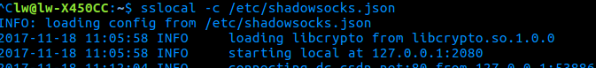
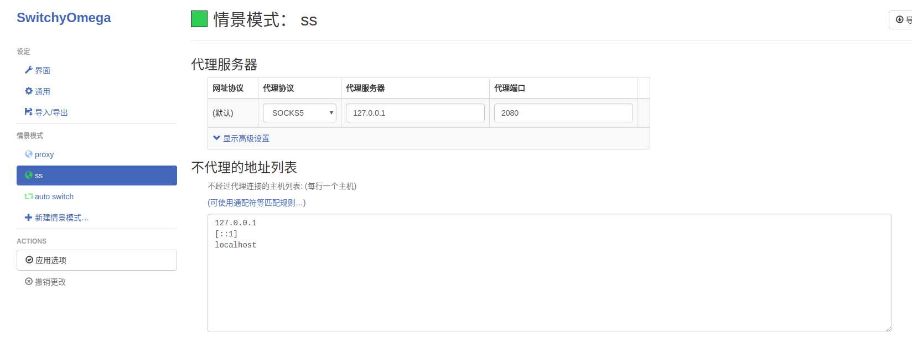
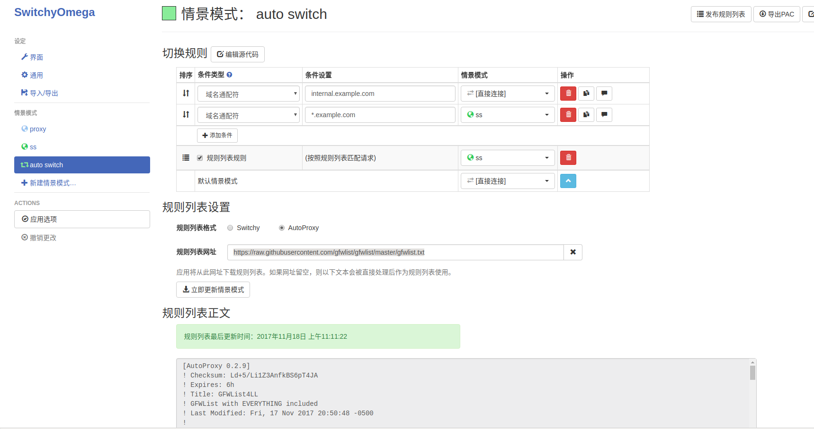

# Ubuntu16.04 Shadowsocks 翻墙配置记录
***
## 一、安装 Shadowsocks
&ensp;&ensp;&ensp;&ensp;直接命令行运行下面的命令即可：

```
sudo apt-get update
sudo apt-get install python-pip

sudo pip install shadowsocks
```

## 二、配置文件
&ensp;&ensp;&ensp;&ensp;在/etc/目录下新建一个 shadowssocks.json 文件，文件大致的内容如下：

```
{
    "server":"服务器的ip",
    "server_port":服务器的端口,
    "local_address":"127.0.0.1",
    "local_port":1080,//端口号，可以自己设置
    "password":"密码",
    "timeout":300,
    "method":"aes-256-cfb",
    "fast_open":false
}
```

&ensp;&ensp;&ensp;&ensp;其中这个网站有免费的账号[ss免费账号](https://github.com/Alvin9999/new-pac/wiki/ss%E5%85%8D%E8%B4%B9%E8%B4%A6%E5%8F%B7)

## 三、运行
&ensp;&ensp;&ensp;&ensp;在命令行中运行：

```
sslocal -c /etc/shadowsocks.json
```

&ensp;&ensp;&ensp;&ensp;成功的话你会看到下面的界面：



&ensp;&ensp;&ensp;&ensp;就说明这部分已经配置完成了，接下来配置chrome浏览器就可以了，你也可以参照[这个链接中断设置网络代理](http://blog.csdn.net/qq_25978793/article/details/49870501),但这个方式在这个系统中智能是全局的，也就是说访问国内的网站也是通过代理，比较慢，一关一开也比较麻烦。推荐是使用下面chrome的方式比较好，切换方便

## 四、chrome配置
- 1、首先安装一个代理插件，地址是[https://github.com/FelisCatus/SwitchyOmega/releases/](https://github.com/FelisCatus/SwitchyOmega/releases/)，往下翻一点在 Downloads中下载第一个 crx 格式的文件
- 2.在chrome地址栏中输入：chrome://extensions/，打开后将刚才下载的文件拖到其中，它会自动提示你进行安装
- 3.新建一个场景模式，打开后的大概如下图所示（是的是全部配置好的的），点击左边的新建场景模式，在名称中填入名字（我的是ss，你可以随便填），配置的内容如下图，其中的代理端口填你设置的端口号,点击左边的应用选项进行保存



- 3.设置规则：首先点击左边的auto switch，其中修改的内容如下图，在规则列表网址中填入：https://raw.githubusercontent.com/gfwlist/gfwlist/master/gfwlist.txt，然后点击下面的立即更新情景模式，最后点应用选项保存即可



- 4.在浏览器的右上角有一个扩展程序的圆圈，点击以后选择auto switch即可进行代理上网，如果不想进行代理选择系统代理即可，这样切换比较方便，还是比较可以的。网速查查资料还是可以，能满足工作的需求的了，看视频之类还是用Windows下的xx-net吧。

## 参考链接：
[Ubuntu14.04 在chrome 安装使用SS过程详解](http://blog.csdn.net/u012986684/article/details/53446107)

[通过UBUNTU 16.04去设置SS SERVER](https://www.cnblogs.com/sunchao1984/p/5940332.html)

[ubuntu乌班图：[1]ubuntu怎样设置代理上网](https://jingyan.baidu.com/article/642c9d34eb2adb644a46f7bd.html)

[Linux中配置SS （非全局模式）](http://blog.csdn.net/qq_25978793/article/details/49870501)

## 问题修复参考
- [AttributeError: /usr/lib/x86_64-Linux-gnu/libcrypto.so.1.1: undefined symbol: EVP_CIPHER_CTX_cleanup](http://blog.csdn.net/blackfrog_unique/article/details/60320737)
- [使用 Vultr 搭建 ShadowSocks /VPS搭建SS（超详细）](https://github.com/sirzdy/shadowsocks)