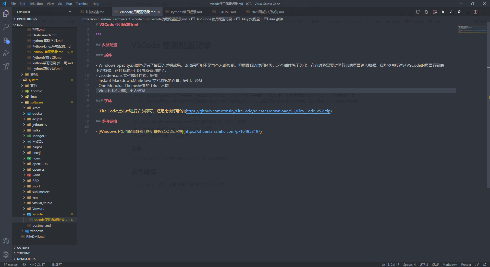

# VSCode 使用配置记录

---

## 安装配置

_配置完后大致样子如下_



### 插件

-   Windows opacity:该插件提供了窗口的透明效果，该效果可能不是每个人都接受。但根据我的使用体验，这个插件除了美化，在有时我需要对照着其他页面输入数据，我能够直接透过 VSCode 的页面看到底下的数据，这样我就不用分屏或者切屏了。
-   vscode-icons:文件图片样式，好看
-   Instant Markdown:Markdown 文档浏览器查看，好用，必备
-   One Monokai Theme:好看的主题，不错
-   Vim:不用不习惯，个人选择

### 字体

-   [Fira Code:点击 ttf 进行安装即可，还是比较好看的](https://github.com/tonsky/FiraCode/releases/download/5.2/Fira_Code_v5.2.zip)

#### 修改字体
设置中搜索 editor.fontLigatures 然后设置


```sh
// 启用字体连字
    "editor.fontLigatures": false,
    // 以像素为单位控制字号。
    "editor.fontSize": 14,
    // 控制字体粗细。
    "editor.fontWeight": "normal",
    "editor.fontFamily": "Fira Code", //后边的引号中写上要设置的字体类型，个人比较喜欢Fira Code
    "editor.fontLigatures": true, //这个控制是否启用字体连字，true启用，false不启用，这里选择启用
    "editor.fontSize": 15, //设置字体大小，这个不多说都明白
```

## 参考链接

-   [Windows 下如何配置好看且好用的 VSCODE 环境](https://zhuanlan.zhihu.com/p/164852197)
